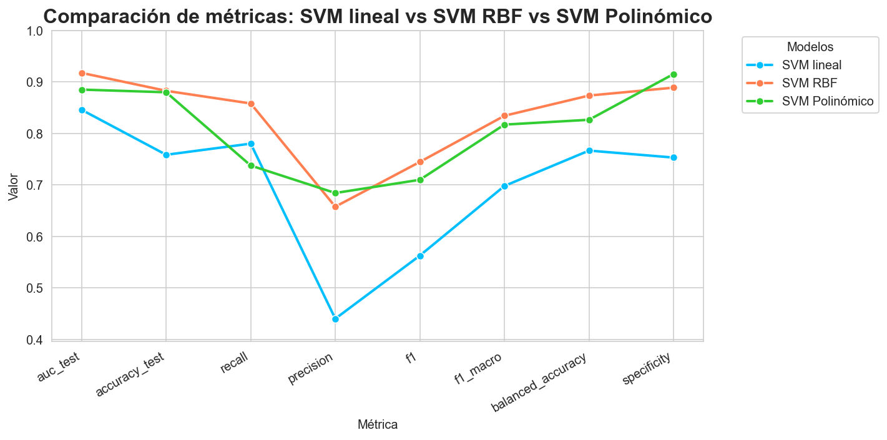
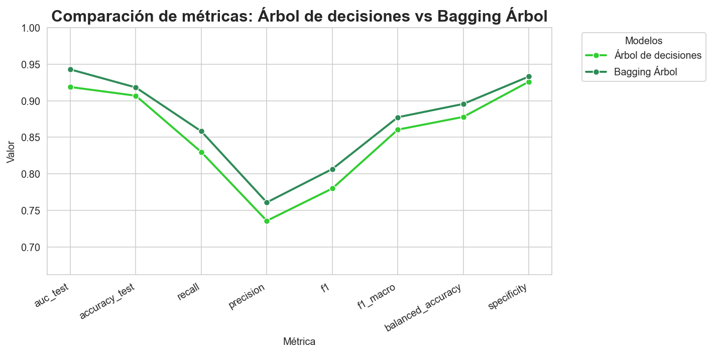
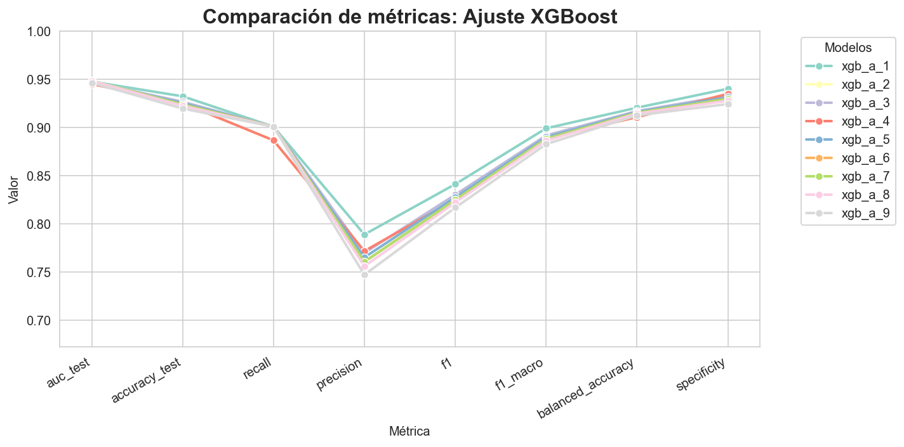
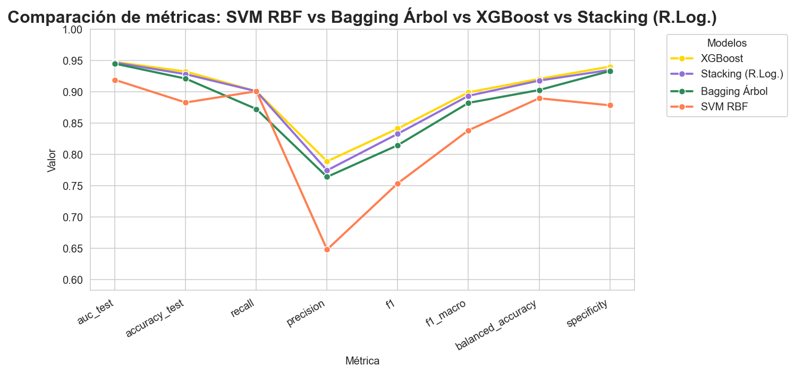
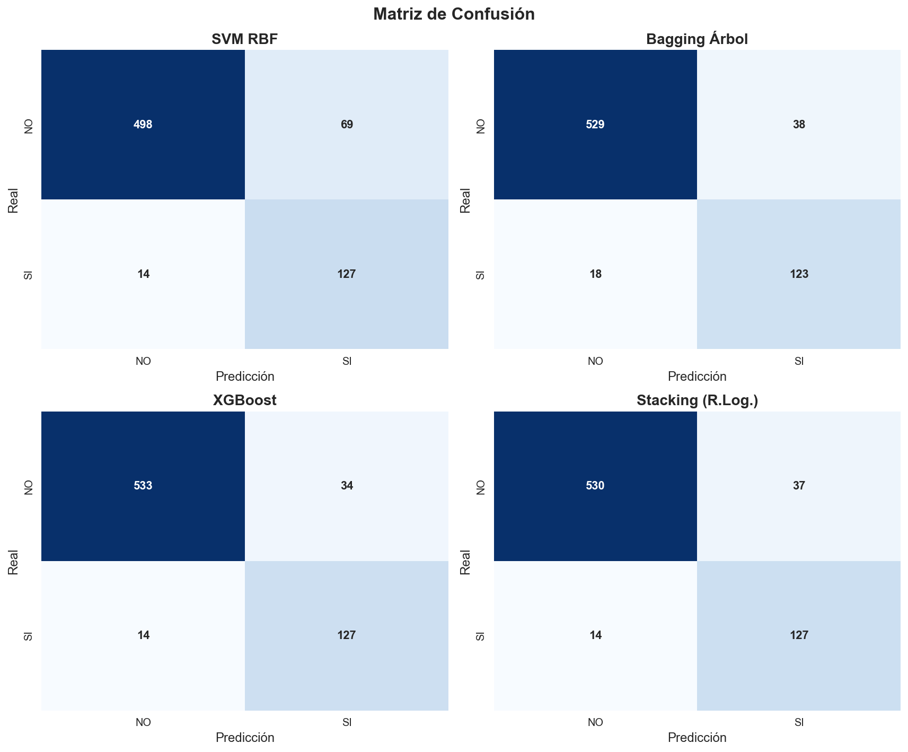
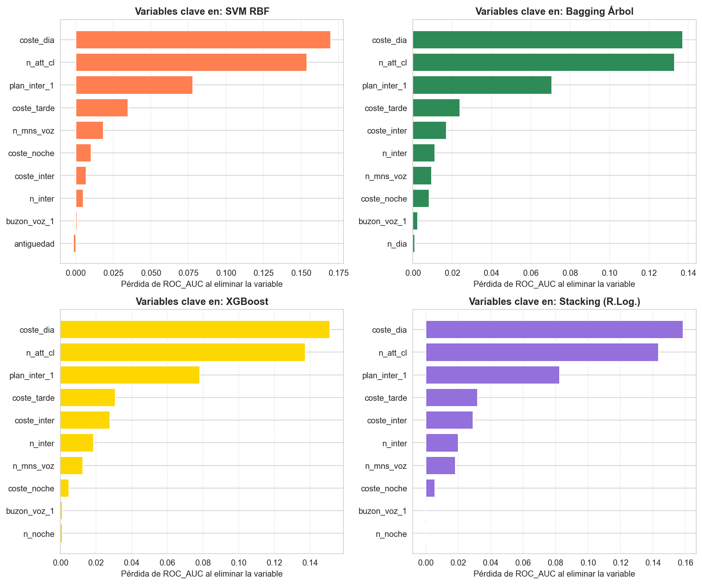

# Modelización predictiva del riesgo de abandono en telecomunicaciones

**Comparación y selección razonada de SVM y métodos ensemble**

Proyecto de **Machine Learning supervisado** orientado a estimar el **riesgo de abandono de clientes de telecomunicaciones** y comparar distintas familias de clasificadores bajo un mismo escenario experimental.

El trabajo cubre el flujo completo: depuración y análisis exploratorio, preprocesado sin fuga de información, modelización SVM, métodos ensemble, comparación homogénea y selección razonada del modelo final.

> Esta versión está preparada como pieza de portfolio profesional. El dataset original, los materiales docentes, los objetos serializados y el dossier académico no se redistribuyen.

## Resumen ejecutivo

El proyecto parte de una base con duplicados, variables redundantes, valores ausentes y una clase positiva minoritaria. Tras la depuración se fija **una única partición TRAIN/TEST**, que se mantiene durante todo el trabajo para que las diferencias entre modelos puedan atribuirse al comportamiento de los algoritmos y no a cambios en la muestra.

La estrategia de modelado no consiste en aceptar automáticamente el mejor resultado de una búsqueda paramétrica. Los grids se utilizan para localizar **zonas competitivas del espacio de hiperparámetros** y, a partir de ellas, se comparan candidatos mediante tablas, gráficos, matrices de confusión, curvas ROC, métricas de generalización y análisis visual.

El cierre del proyecto enfrenta cuatro modelos finales sobre exactamente el mismo conjunto de TEST: **SVM RBF, Bagging Árbol, XGBoost y Stacking**.

## Resultado final

| Modelo | AUC test | Accuracy test | Recall | Precision | F1 | FP | FN |
|---|---:|---:|---:|---:|---:|---:|---:|
| **XGBoost** | **0.9474** | **0.9322** | **0.9007** | **0.7888** | **0.8411** | **34** | **14** |
| Stacking (R.Log.) | 0.9467 | 0.9280 | 0.9007 | 0.7744 | 0.8328 | 37 | 14 |
| Bagging Árbol | 0.9447 | 0.9209 | 0.8723 | 0.7640 | 0.8146 | 38 | 18 |
| SVM RBF | 0.9189 | 0.8828 | 0.9007 | 0.6480 | 0.7537 | 69 | 14 |

**XGBoost** se selecciona como modelo final por ofrecer el mejor equilibrio entre capacidad discriminante, detección de la clase positiva y control de falsos positivos.

El **Stacking** queda como alternativa muy próxima. Si XGBoost no hubiese formado parte de la comparación global, habría sido la solución seleccionada, aunque con una mayor complejidad estructural y coste computacional.

## Flujo metodológico

### 1. Depuración y análisis exploratorio

La base original contiene **9.200 registros**. Se identifican **5.662 duplicados exactos** y, tras las comprobaciones adicionales de identificadores, la base de trabajo queda en **3.536 observaciones**.

La variable objetivo presenta aproximadamente:

- **80,06 %** de clase 0;
- **19,94 %** de clase 1.

Este desbalanceo hace que la accuracy no sea suficiente por sí sola. Por ello, el análisis posterior incorpora especialmente **AUC, recall, precision, F1, balanced accuracy, specificity, falsos positivos y falsos negativos**.

También se estudia la coherencia entre minutos y costes, la asociación de variables categóricas con la respuesta, la redundancia entre variables numéricas y la distribución de las variables según la clase.

### 2. Modelización SVM

La familia SVM se utiliza como primer bloque de modelado para comparar fronteras lineales y no lineales bajo el mismo esquema de validación.

Se evalúan tres kernels:

- lineal;
- RBF;
- polinómico.



El kernel **RBF** ofrece el mejor compromiso global dentro de la familia SVM. Posteriormente se concentra el análisis en una zona paramétrica más reducida y se selecciona manualmente la configuración final:

```text
kernel = rbf
C = 0.9
gamma = 0.08
class_weight = balanced
```

La selección se realiza mediante una lectura conjunta de validación cruzada, resultados sobre TEST, matrices de confusión, ROC y estabilidad; no mediante una regla automática basada únicamente en `best_estimator_`.

### 3. Métodos ensemble

El bloque ensemble analiza enfoques con lógicas diferentes.

#### Bagging

Se compara el efecto de Bagging sobre:

- SVM RBF;
- regresión logística;
- árbol de decisión.

La mejora realmente clara aparece cuando Bagging se aplica sobre el árbol, reduciendo la inestabilidad del estimador base y mejorando de forma conjunta las métricas principales.



Tras el ajuste, el Bagging Árbol final utiliza:

```text
n_estimators = 90
max_samples = 0.88
max_features = 0.65
```

#### Random Forest y XGBoost

Random Forest se incorpora como contraste arbóreo adicional.

XGBoost añade una lógica diferente a Bagging: aprendizaje secuencial orientado a corregir errores previos. Tras una búsqueda inicial y un ajuste concentrado en la región competitiva, ofrece el mejor perfil individual del bloque ensemble.



#### Stacking

El Stacking final combina modelos base heterogéneos:

```text
SVM RBF
Regresión Logística
XGBoost
        ↓
Meta-modelo: Regresión Logística L2 balanceada, C = 2
```

El objetivo es combinar señales complementarias y permitir que el meta-modelo aprenda cómo ponderarlas, en lugar de depender de una única familia de clasificadores.

## Comparación global

Los cuatro modelos finales se vuelven a evaluar con una misma función, sobre la misma partición TRAIN/TEST y con el mismo conjunto de variables.



La comparación muestra tres perfiles especialmente competitivos, pero XGBoost conserva una ventaja operativa importante: mantiene el mismo recall que Stacking y SVM RBF, con **14 falsos negativos**, reduciendo simultáneamente los falsos positivos hasta **34**.



Esta diferencia es especialmente relevante porque permite detectar el mismo número de clientes de la clase positiva que los modelos más sensibles, pero evitando una cantidad mayor de falsas alarmas.

## Interpretación de variables

La importancia por permutación se utiliza como herramienta interpretativa, no como un nuevo proceso de selección de variables.

Los cuatro modelos coinciden en un núcleo de señales especialmente relevantes:

- `coste_dia`;
- `n_att_cl`;
- `plan_inter_1`.



La coincidencia entre algoritmos diferentes refuerza la coherencia de la interpretación: los mejores modelos se apoyan en señales similares, pero las combinan con distinta eficacia.

## Decisiones metodológicas destacadas

El proyecto mantiene varios criterios de control para que la comparación sea coherente:

1. **Partición TRAIN/TEST única y estratificada** para todos los modelos.
2. **Preprocesado aprendido exclusivamente con TRAIN** y aplicado posteriormente a TEST.
3. **Validación cruzada estratificada** para explorar hiperparámetros.
4. **Selección manual y razonada de candidatos**, apoyada en tablas y visualizaciones.
5. **Comparación homogénea** de los modelos ya cerrados.
6. **Análisis de generalización TRAIN/TEST** para detectar comportamientos frágiles.
7. **Lectura operativa de FP y FN**, además de las métricas agregadas.

El objetivo no es maximizar una única cifra, sino seleccionar una solución sólida desde una perspectiva predictiva, metodológica y operativa.

## Funciones auxiliares y modularización

`funciones_ml.py` centraliza tareas que se reutilizan a lo largo de todo el proyecto. Esto reduce duplicidades y asegura que los modelos se evalúen con criterios homogéneos.

Entre las funciones principales se encuentran utilidades para:

- evaluación y resumen de modelos;
- lectura de resultados de `GridSearchCV`;
- gráficos de parámetros y heatmaps;
- comparación de candidatos;
- matrices de confusión y classification reports;
- curvas ROC;
- análisis de sobreajuste;
- curvas de aprendizaje y validación;
- importancia por permutación;
- análisis OOB de Bagging;
- caracterización del Stacking;
- ranking y heatmap global de modelos.

La separación de estas funciones permite mantener los cuatro scripts principales centrados en el flujo metodológico y deja una base reutilizable para futuros proyectos.

## Estructura del repositorio

```text
telecom-model-selection/
├── README.md
├── LICENSE
├── NOTICE.md
├── requirements.txt
├── .gitignore
├── data/
│   └── README.md
├── images/
│   ├── README.md
│   ├── eda-correlacion-minutos-costes.png
│   ├── eda-distribucion-variable-objetivo.png
│   ├── svm-comparacion-kernels.png
│   ├── svm-roc-kernels.png
│   ├── svm-ajuste-rbf.png
│   ├── svm-rbf-matriz-confusion.png
│   ├── bagging-arbol-comparacion.png
│   ├── bagging-arbol-ajuste.png
│   ├── bagging-arbol-matriz-confusion.png
│   ├── xgboost-candidatos.png
│   ├── xgboost-ajuste.png
│   ├── xgboost-matriz-confusion.png
│   ├── stacking-candidatos.png
│   ├── stacking-matriz-confusion.png
│   ├── comparacion-modelos-finales.png
│   ├── matrices-confusion-finales.png
│   ├── importancia-variables-finales.png
│   ├── ranking-modelos-finales.png
│   └── heatmap-modelos-finales.png
└── src/
    ├── funciones_ml.py
    ├── 01_depuracion_eda_ml.py
    ├── 02_svm_ml.py
    ├── 03_ensemble_ml.py
    └── 04_comparacion_ml.py
```

La carpeta `images/` contiene una **selección curada de las figuras regeneradas con los scripts finales**. No se incluyen todas las salidas generadas durante el desarrollo para mantener el repositorio legible y orientado a portfolio.

## Ejecución

Instala las dependencias:

```bash
pip install -r requirements.txt
```

Coloca una copia autorizada del dataset en:

```text
data/BBDD_ML_TAREA.csv
```

Ejecuta los scripts en este orden:

```bash
python src/01_depuracion_eda_ml.py
python src/02_svm_ml.py
python src/03_ensemble_ml.py
python src/04_comparacion_ml.py
```

Los scripts crean en `outputs/` los objetos intermedios necesarios para que cada bloque reutilice exactamente los resultados del anterior.

## Tecnologías y técnicas

- Python
- pandas y NumPy
- Matplotlib y Seaborn
- SciPy
- scikit-learn
- XGBoost
- análisis exploratorio de datos
- tratamiento de datos ausentes
- codificación One-Hot
- escalado robusto
- SVM lineal, RBF y polinómico
- regresión logística
- árboles de decisión
- Bagging
- Random Forest
- XGBoost
- Stacking
- GridSearchCV
- validación cruzada estratificada
- análisis de clases desbalanceadas
- AUC, accuracy, recall, precision, F1, balanced accuracy y specificity
- matrices de confusión
- curvas ROC
- curvas de aprendizaje y validación
- importancia de variables por permutación
- análisis TRAIN/TEST
- modularización de funciones reutilizables

## Materiales no incluidos

Este repositorio no redistribuye:

- `BBDD_ML_TAREA.csv`;
- archivos `.pickle`, `.pkl` o modelos serializados;
- el enunciado original de la actividad;
- materiales docentes;
- el dossier académico de entrega;
- el conjunto completo de figuras de desarrollo.

El repositorio contiene únicamente el código, documentación y una selección de salidas gráficas necesarias para mostrar el trabajo como portfolio.

## Autor

**Carlos Ayllón Motto**  
Málaga, España

## Licencia

El código y la documentación originales de esta versión se publican bajo licencia **MIT**.

La licencia no concede derechos sobre el dataset original, materiales docentes ni otros contenidos de terceros relacionados con el proyecto. Consulta [LICENSE](LICENSE) y [NOTICE.md](NOTICE.md).
